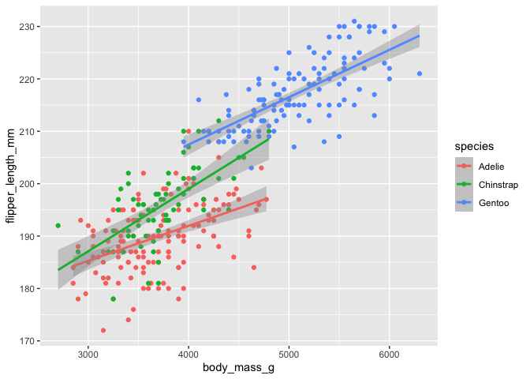
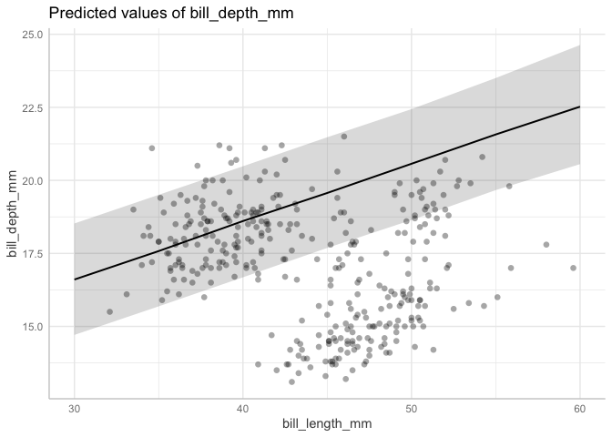
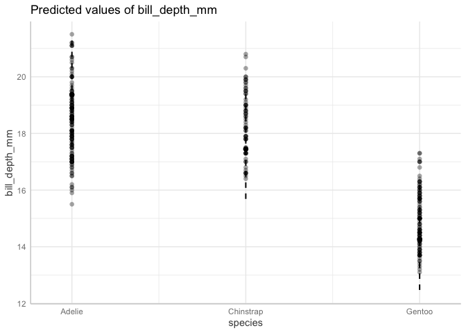

Activity 9: Statistical reasoning 2: multiple regression
================

Welcome! This is the second statistical reasoning activity. We will
learn how to implement multiple regression models using the `brms`
package and get more practice interpreting coefficients.

------------------------------------------------------------------------

You will submit one output for this activity:

1.  A **PDF** of a rendered Quarto document with all of your R code.
    Please create a new Quarto document (e.g. don’t use this
    `README.qmd`), include all of the code that appears in this
    document, in addition to adding your own code and **answers to all
    of the questions** in the “Q#” sections. Submit this through
    Gradescope.

*If you have trouble submitting as a PDF, please ask Calvin or Malin for
help. If we still can’t solve it, you can submit the .qmd file instead.*

A reminder: **Please label the code** in your final submission in two
ways: 1) denote your answers to each question using headers that
correspond to the question you’re answering and 2) thoroughly “comment”
your code: remember, this means annotating your code directly by typing
descriptions of what each line does after a `#`. This will help future
you!

------------------------------------------------------------------------

Let’s start by reading in the relevant packages

``` r
library(brms) # for statistics
library(tidyverse) # for data wrangling
library(ggeffects) # for  prediction plots
library(palmerpenguins) # data we'll be using
```

------------------------------------------------------------------------

# 1. Multiple regression

The natural world is complex, and more often than not, there are
multiple variables that influence a given response that we measure.
Think about tomatoes in your garden: you could measure how many tomatoes
your plants produce as a function of how much you water them. But what
about how much sunlight your plants get? Water and sunlight are probably
both important in determining how many tomatoes grow on your plant. To
account for this, we use **multiple regression**.

Multiple regression is when we want to put more than one predictor
variable into our model. The model equation would thus look something
like this:

$$y = intercept + slope_1 \times variable_1 + slope_2 \times variable_2$$

We’re going to demonstrate how to use multiple regression on the palmer
penguins dataset. First, though, we are going to start off with some
refresher on interpreting a simpler linear regression

------------------------------------------------------------------------

## 1.1 Refresh on coefficients

This section: Univariate regression of flipper length \~ body mass

``` r
penguins <- palmerpenguins::penguins

penguins %>% 
  ggplot(aes(x = body_mass_g,
             y = flipper_length_mm)) +
  geom_point() +
  geom_smooth(method = "lm")
```


Run the model

``` r
# flipper length by body mass model
m.flip.mass <- 
  brm(data = penguins, # Give the model the penguins data
      # Choose a gaussian (normal) distribution
      family = gaussian,
      # Specify the model here. 
      flipper_length_mm ~ 1 + body_mass_g,
      # Here's where you specify parameters for executing the Markov chains
      # We're using similar to the defaults, except we set cores to 4 so the analysis runs faster than the default of 1
      iter = 2000, warmup = 1000, chains = 4, cores = 4,
      # Setting the "seed" determines which random numbers will get sampled.
      # In this case, it makes the randomness of the Markov chain runs reproducible 
      # (so that both of us get the exact same results when running the model)
      seed = 4,
      # Save the fitted model object as output - helpful for reloading in the output later
      file = "output/m.flip.mass")
```

Assess the model fitting by looking at Rhat:

``` r
summary(m.flip.mass)
```

     Family: gaussian 
      Links: mu = identity 
    Formula: flipper_length_mm ~ 1 + body_mass_g 
       Data: penguins (Number of observations: 342) 
      Draws: 4 chains, each with iter = 2000; warmup = 1000; thin = 1;
             total post-warmup draws = 4000

    Regression Coefficients:
                Estimate Est.Error l-95% CI u-95% CI Rhat Bulk_ESS Tail_ESS
    Intercept     136.74      2.00   132.87   140.72 1.00     4466     2908
    body_mass_g     0.02      0.00     0.01     0.02 1.00     4742     2903

    Further Distributional Parameters:
          Estimate Est.Error l-95% CI u-95% CI Rhat Bulk_ESS Tail_ESS
    sigma     6.94      0.26     6.45     7.47 1.00     1775     1712

    Draws were sampled using sampling(NUTS). For each parameter, Bulk_ESS
    and Tail_ESS are effective sample size measures, and Rhat is the potential
    scale reduction factor on split chains (at convergence, Rhat = 1).

Rhat is 1 - looks good!

``` r
plot(m.flip.mass)
```


Looks like the chains converged nicely and the posterior distributions
are smooth. Nice!

Now let’s dig into the actual results by examining the parameter
estimates. We can look at the posterior plots (just above) and look at
the parameter estimates and 95% compatibility intervals from the model
summary:

``` r
summary(m.flip.mass)
```

     Family: gaussian 
      Links: mu = identity 
    Formula: flipper_length_mm ~ 1 + body_mass_g 
       Data: penguins (Number of observations: 342) 
      Draws: 4 chains, each with iter = 2000; warmup = 1000; thin = 1;
             total post-warmup draws = 4000

    Regression Coefficients:
                Estimate Est.Error l-95% CI u-95% CI Rhat Bulk_ESS Tail_ESS
    Intercept     136.74      2.00   132.87   140.72 1.00     4466     2908
    body_mass_g     0.02      0.00     0.01     0.02 1.00     4742     2903

    Further Distributional Parameters:
          Estimate Est.Error l-95% CI u-95% CI Rhat Bulk_ESS Tail_ESS
    sigma     6.94      0.26     6.45     7.47 1.00     1775     1712

    Draws were sampled using sampling(NUTS). For each parameter, Bulk_ESS
    and Tail_ESS are effective sample size measures, and Rhat is the potential
    scale reduction factor on split chains (at convergence, Rhat = 1).

### Q1.1: What is the effect of body mass on flipper length?

1)  What is the magnitude of the relationship between body mass and
    flipper length (e.g. the slope)? Report your result using the units
    of these variables.

2)  Do a quick visual estimate of the slope from the ggplot graph above
    (e.g. take two points and calculate the difference in y divided by
    the difference in x). What is your estimate? To what extent does the
    model’s slope effect match up with your slope from the ggplot?

------------------------------------------------------------------------

### Q1.2: Can we claim that this effect is different from zero?

Using what you learned last class, interpret whether the slope seems to
have a low or high probability of being different from zero. What do you
conclude? Why or why not do you reach this conclusion?

|                                                                                                                                                                                                                                                                                                              |
|--------------------------------------------------------------------------------------------------------------------------------------------------------------------------------------------------------------------------------------------------------------------------------------------------------------|
| Let’s also do this calculation more precisely by adding up the fraction of the posterior that is greater than zero.                                                                                                                                                                                          |
| ::: {.cell}                                                                                                                                                                                                                                                                                                  |
| `{.r .cell-code} as_draws_df(m.flip.mass) |> # extract the posterior samples from the model estimate select(b_body_mass_g) |> # pull out the latitude samples from all 4 chains. we'll get a warning that we can ignore. summarize(p_slope_greaterthan_zero = sum(b_body_mass_g > 0)/length(b_body_mass_g))` |
| ::: {.cell-output .cell-output-stdout}                                                                                                                                                                                                                                                                       |

### Q1.3: What is the probability that the slope is different from zero?

Look at the output from the code you just ran.

------------------------------------------------------------------------

## 1.2 Additive models

(Need to make a point about geom_smooth() only graphing interactive
models by default)

Now it’s time to get into multiple regression. In particular, we are
going to use additive multiple regression.

Let’s start by plotting a new set of variables. Now we’re asking: are
bill length and bill depth associated among the penguins in the dataset?

Let’s plot the data first

``` r
penguins %>% 
  ggplot(aes(x = bill_length_mm,
             y = bill_depth_mm)) +
  geom_point() +
  # Let's add in a basic lm just to visualize
  geom_smooth(method = "lm")
```



### Run a normal univariate model

Now let’s run a normal univariate model with these two variables:

``` r
# flipper length by body mass model
m.depth.length <- 
  brm(data = penguins, # Give the model the penguins data
      # Choose a gaussian (normal) distribution
      family = gaussian,
      # Specify the model here. 
      bill_depth_mm ~ 1 + bill_length_mm,
      # Here's where you specify parameters for executing the Markov chains
      # We're using similar to the defaults, except we set cores to 4 so the analysis runs faster than the default of 1
      iter = 2000, warmup = 1000, chains = 4, cores = 4,
      # Setting the "seed" determines which random numbers will get sampled.
      # In this case, it makes the randomness of the Markov chain runs reproducible 
      # (so that both of us get the exact same results when running the model)
      seed = 4,
      # Save the fitted model object as output - helpful for reloading in the output later
      file = "output/m.depth.length")
```

### Assess and interpret the univariate model

``` r
summary(m.depth.length)
```

     Family: gaussian 
      Links: mu = identity 
    Formula: bill_depth_mm ~ 1 + bill_length_mm 
       Data: penguins (Number of observations: 342) 
      Draws: 4 chains, each with iter = 2000; warmup = 1000; thin = 1;
             total post-warmup draws = 4000

    Regression Coefficients:
                   Estimate Est.Error l-95% CI u-95% CI Rhat Bulk_ESS Tail_ESS
    Intercept         20.89      0.86    19.24    22.58 1.00     3946     2774
    bill_length_mm    -0.09      0.02    -0.12    -0.05 1.00     3994     2771

    Further Distributional Parameters:
          Estimate Est.Error l-95% CI u-95% CI Rhat Bulk_ESS Tail_ESS
    sigma     1.93      0.08     1.79     2.08 1.00     4238     2987

    Draws were sampled using sampling(NUTS). For each parameter, Bulk_ESS
    and Tail_ESS are effective sample size measures, and Rhat is the potential
    scale reduction factor on split chains (at convergence, Rhat = 1).

``` r
plot(m.depth.length)
```


The Rhat, posterior distributions, and chains look good, so we can say
that our model ran well.

------------------------------------------------------------------------

### Q1.4 Write a couple results sentences with your conclusions about whether bill length is associated with bill depth given this model. Include the estimate for the slope and it’s biological interpretation, as well as whether or not this slope seems different from zero (and why you think that).

------------------------------------------------------------------------

### Run the same model with species as a second predictor

Time to do multiple regression!! From our past experience, we know that
there’s more to this penguin story. In fact, there are three separate
species of penguins here. Let’s modify our question to be:

Are bill length and bill depth associated among the penguins in the
dataset, and does bill depth differ with penguin species?

To answer this question, we need to turn to multiple regression, where
we will add in `species` as a variable to our model. Let’s do that
straight away. We are simply going to add in the `species` column to our
model from above. We are also going to change the “intercept” to 0; this
will allow for a bit easier of interpretation of the effect of the
categorical variable of `species.`

``` r
# flipper length by body mass model
m.depth.length.species <- 
  brm(data = penguins, # Give the model the penguins data
      # Choose a gaussian (normal) distribution
      family = gaussian,
      # Specify the model here. 
      bill_depth_mm ~ 0 + bill_length_mm + species,
      # Here's where you specify parameters for executing the Markov chains
      # We're using similar to the defaults, except we set cores to 4 so the analysis runs faster than the default of 1
      iter = 2000, warmup = 1000, chains = 4, cores = 4,
      # Setting the "seed" determines which random numbers will get sampled.
      # In this case, it makes the randomness of the Markov chain runs reproducible 
      # (so that both of us get the exact same results when running the model)
      seed = 4,
      # Save the fitted model object as output - helpful for reloading in the output later
      file = "output/m.depth.length.species")
```

------------------------------------------------------------------------

### Q1.5 Assess the model: did it run correctly?

Assess the model using Rhat, the posterior distributions, and the plot
of chains: did it run well?

``` r
summary(m.depth.length.species)
```

     Family: gaussian 
      Links: mu = identity 
    Formula: bill_depth_mm ~ 0 + bill_length_mm + species 
       Data: penguins (Number of observations: 342) 
      Draws: 4 chains, each with iter = 2000; warmup = 1000; thin = 1;
             total post-warmup draws = 4000

    Regression Coefficients:
                     Estimate Est.Error l-95% CI u-95% CI Rhat Bulk_ESS Tail_ESS
    bill_length_mm       0.20      0.02     0.16     0.23 1.00      686      796
    speciesAdelie       10.65      0.71     9.22    12.07 1.01      685      794
    speciesChinstrap     8.73      0.89     6.93    10.51 1.00      693      840
    speciesGentoo        5.55      0.86     3.80     7.27 1.00      686      784

    Further Distributional Parameters:
          Estimate Est.Error l-95% CI u-95% CI Rhat Bulk_ESS Tail_ESS
    sigma     0.96      0.04     0.89     1.03 1.00     1254     1544

    Draws were sampled using sampling(NUTS). For each parameter, Bulk_ESS
    and Tail_ESS are effective sample size measures, and Rhat is the potential
    scale reduction factor on split chains (at convergence, Rhat = 1).

``` r
plot(m.depth.length.species)
```


------------------------------------------------------------------------

### Interpret an additive model

Ok, now let’s dig into the model output and interpret our first additive
multiple regression.

``` r
summary(m.depth.length.species)
```

     Family: gaussian 
      Links: mu = identity 
    Formula: bill_depth_mm ~ 0 + bill_length_mm + species 
       Data: penguins (Number of observations: 342) 
      Draws: 4 chains, each with iter = 2000; warmup = 1000; thin = 1;
             total post-warmup draws = 4000

    Regression Coefficients:
                     Estimate Est.Error l-95% CI u-95% CI Rhat Bulk_ESS Tail_ESS
    bill_length_mm       0.20      0.02     0.16     0.23 1.00      686      796
    speciesAdelie       10.65      0.71     9.22    12.07 1.01      685      794
    speciesChinstrap     8.73      0.89     6.93    10.51 1.00      693      840
    speciesGentoo        5.55      0.86     3.80     7.27 1.00      686      784

    Further Distributional Parameters:
          Estimate Est.Error l-95% CI u-95% CI Rhat Bulk_ESS Tail_ESS
    sigma     0.96      0.04     0.89     1.03 1.00     1254     1544

    Draws were sampled using sampling(NUTS). For each parameter, Bulk_ESS
    and Tail_ESS are effective sample size measures, and Rhat is the potential
    scale reduction factor on split chains (at convergence, Rhat = 1).

------------------------------------------------------------------------

#### The effect of species

You’ll notice that added to the table is not a single “Species”
coefficient estimate, but three coefficient estimates: one for each
factor in our `species` column. Our model is a model of
`bill depth ~ bill length` with *three separate intercepts*, one for
each of the three species. We haven’t really talked about intercepts in
the activities, but intercepts are the y-value when the x-value equals
zero. This isn’t super biologically meaningful in that sense (because
the bill width of a penguin will almost certainly not be 10.65 when the
bill length equals 0…), BUT, in an additive model, it tells us the
relative differences between the different factor levels across all
values of your other variable. In other words, it tells us the
differences in bill width between species.

For instance, the value for Gentoo is 5.55, for Chinstrap it’s 8.73, and
for Adelie it’s 10.64. Let’s directly compare Adelie and Chinstrap. This
means that for any given bill length, Adelie penguins have
`10.64 - 8.73 =` 1.91mm deeper bills than Chinstraps. Similarly, Adelie
penguins have `10.64 - 5.55 =` 5.09mm deeper bills than Gentoo penguins.

Let’s graph our data using ggplot to get a sense of this difference, but
this time, with penguin species assigned to color.

``` r
penguins %>% 
  ggplot(aes(x = bill_length_mm,
             y = bill_depth_mm,
             color = species)) +
  geom_point() +
  geom_smooth(method = "lm")
```


#### Q1.6 Visually measure differences in bill depth between species

Visually measure differences in bill depth between species; choose a
region of the x-axis which has data for all three species (e.g. around
45mm). Estimate the difference in bill depth (the y-axis) between a)
Adelie and Chinstrap and b) Adelie and Gentoo. Are those differences
consistent with the differences that we calculated from the model?

------------------------------------------------------------------------

#### The effect of bill length

Now let’s move on to interpreting the slope, which in this case is the
effect of `bill length`.

The model output gave us a slope estimate of 0.20, which we interpret as
for every 1mm of bill length, bill depth increases by 0.20mm. The 95%
credible intervals are between 0.16 and 0.23, indicating that we can be
confident that zero is not consistent with our model’s estimate of
slope.

``` r
# compatibility interval. the shows uncertainty in the average response.
confm.depth.length.species <- predict_response(m.depth.length.species,
                                               condition = c(bill_length_mm = 0,
                                                             species = c(penguins$species %>% unique())))
confm.depth.length.species
```

    $bill_length_mm
    # Predicted values of bill_depth_mm

    bill_length_mm | Predicted |       95% CI
    -----------------------------------------
                30 |     16.60 | 16.25, 16.96
                35 |     17.59 | 17.39, 17.80
                40 |     18.59 | 18.43, 18.74
                45 |     19.58 | 19.31, 19.85
                50 |     20.58 | 20.13, 21.01
                55 |     21.57 | 20.95, 22.18
                60 |     22.57 | 21.76, 23.36

    Adjusted for:
    * species = Adelie

    $species
    # Predicted values of bill_depth_mm

    species   | Predicted |      95% CI
    -----------------------------------
    Adelie    |     10.62 | 9.22, 12.07
    Chinstrap |      8.69 | 6.93, 10.51
    Gentoo    |      5.52 | 3.80,  7.27


    attr(,"class")
    [1] "ggalleffects" "list"        
    attr(,"model.name")
    [1] "m.depth.length.species"

``` r
plot(confm.depth.length.species, show_data = TRUE) 
```

    $bill_length_mm


    $species


``` r
# prediction interval. this shows uncertainty in the data around the average response.
confm.depth.length.species <- predict_response(m.depth.length.species, interval = 'prediction')
plot(confm.depth.length.species, show_data = TRUE)
```

    $bill_length_mm




    $species



### Q1.6 Describe how your conclusions changed between running the univariate regression and the multiple regression

How did adding `species` change the results of our model? Fill in the
blanks and add a couple sentences at the end explaining how your
interpretation of the effect of `bill length` on `bill depth` changed
upon adding `species`.

*The results from the univariate regression of
`bill depth ~ bill length` indicate that the effect of bill length on
bill depth was a change of \_\_\_\_mm of bill depth for every 1mm of
bill length. When we add in `species`, the results from the multivariate
regression of `bill depth ~ bill length + species` indicate that the
effect of bill length on bill depth was a change of \_\_\_\_mm of bill
depth for every 1mm of bill length.*

------------------------------------------------------------------------

# 2. Run multiple regression on your own

------------------------------------------------------------------------

### Render to PDF

When you have finished, remember to pull, stage, commit, and push with
GitHub:

- Pull to check for updates to the remote branch
- Stage your edits (after saving your document!) by checking the
  documents you’d like to push
- Commit your changes with a commit message
- Push your changes to the remote branch

Then submit the well-labeled PDF on Gradescope. Thanks!
